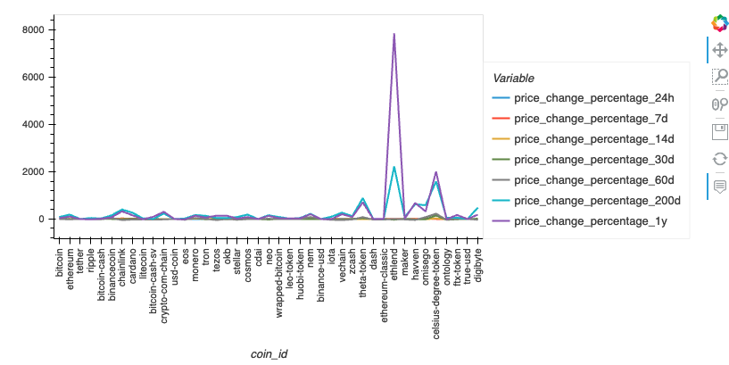
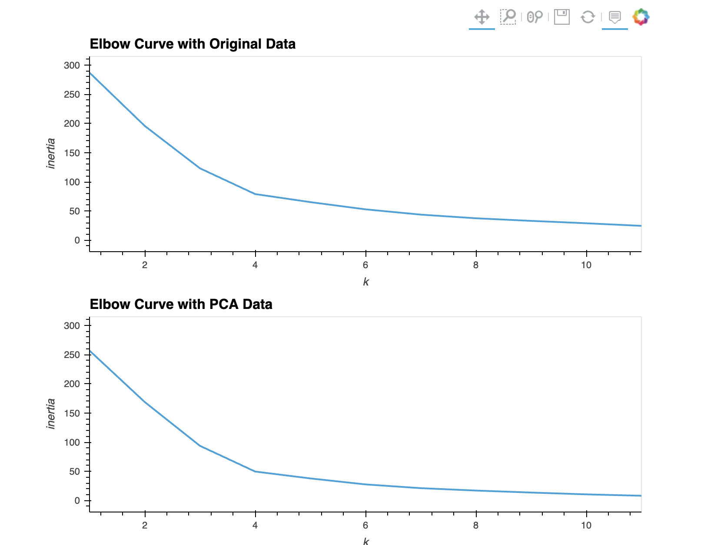
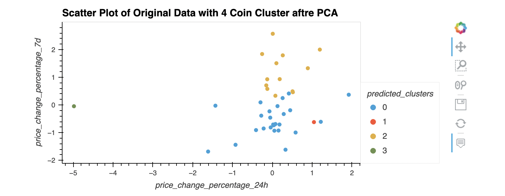

# Crypto_investment-scikit_learn_clustering

This Crypto Investment tool utilizes the KMeans algorithm to perform segmentation analysis of cryptocurrency profitability. The algorithm generates scatter plots with varying n_clusters to facilitate a comprehensive analysis of the dataset, resulting in a more robust evaluation of the cryptocurrency investments.

The CSV file provided the Resources folder contains price change data of cryptocurrencies in different periods.

The steps for this challenge are broken out into the following sections:

* Import the Data(provided in the Resources folder)
* Prepare the Data 
* Find the Best Value for `k` using the original Data
* Cluster Cryptocurrencies with K-means Using the Original Data
* Optimize Clusters with Principal Component Analysis
* Find the Best Value for `k` Using the PCA Data
* Cluster the Cryptocurrencies with K-means Using the PCA Data
* Visualize and Compare the Results

## Technologies

This project leverages the following technologies:

* [Python 3.7.13](https://www.python.org/downloads/release/python-385/) - The programming language used in the project.
* [Pandas](https://pandas.pydata.org/) - A Python library used for efficient data manipulation.
* [Jupyter Lab](https://jupyter.org/) - An interactive development environment used to create and share documents containing live code, equations, visualizations, and narrative text.
* [PyVizlot](https://pyviz.org/) - A Python visualization package that provides a single platform for accessing multiple visualization libraries.
 * [hvPlot 0.8.0](https://hvplot.holoviz.org/) - A plotting library used to create interactive line/bar graphs and scatter plots.
* [Scikit-learn 1.0.2](https://scikit-learn.org/stable/index.html) - A Python library containing efficient tools for machine learning and statistical modeling, including classification, regression, clustering, and dimensionality reduction.
 * [KMeans](https://scikit-learn.org/stable/modules/generated/sklearn.cluster.KMeans.html) - A powerful unsupervised machine learning algorithm used to solve complex problems.
 * [StandardScaler](https://scikit-learn.org/stable/modules/generated/sklearn.preprocessing.StandardScaler.html) - A function used to remove the mean and scale each feature/variable to unit variance.
 * [Principal Component Analysis (PCA)](https://scikit-learn.org/stable/modules/generated/sklearn.decomposition.PCA.html) - A statistical technique used to speed up machine learning algorithms when dealing with a large number of features or dimensions.
 
 ## Installation 
 
 To run this project, you will need to install the following technologies:
 
1. To run this project, you'll need to install [Python 3.7.13](https://www.python.org/downloads/release/python-385/)
2. To install Pandas, run the following command in your terminal or command prompt:
```
pip install pandas
```
3. To install Jupyter Lab, run the following command in your terminal or command prompt:
```
pip install jupyterlab
```
4. To install the PyViz packages, check that your development environment is active, and then run the following command:
```
conda install -c pyviz hvplot
```
* PyViz also require specific version of NodeJS check that your development environment is active, and then run the following command:
```
conda install -c conda-forge nodejs=12 
```
* To confirm the installation of the PyViz packages, then run the following command:
```
conda list hvplot
```
5. Installing Scikit-learn
* To install the Scikit-learn, check that your development environment is active, and then run the following command:
```
pip install -U scikit-learn
```
* To check if scikit-learn is already installed, you can run the following code on your dev environment:
```
conda list scikit-learn
```
6. After installing the technologies, you can launch Jupyter Lab by running the following command in your terminal or command prompt:
```
jupyter lab
```
7. Run the file **Crypto_investment-scikit_learn_clustering.ipynb** in the Jupyter Notebook


## Usage 

Assume that k refers to lowercase k. The instructions will specify "uppercase K" where necessary.
### Find the Best Value for k Using the Original Data

In this section, we will use the elbow method to find the best value for k.

1. Code the elbow method algorithm to find the best value for k. Use a range from 1 to 11.

2. Plot a line chart with all the inertia values computed with the different values of k to visually identify the optimal value for k.


3. Plot a line Elbow Curve chart with all the inertia values computed with the different values of k to visually identify the optimal value for k.


4. Answer the following question: What is the best value for k?

### Cluster Cryptocurrencies with K-means Using the Original Data

In this section, we will use the K-means algorithm with the best value for k (found in the previous section) in order to cluster the cryptocurrencies according to the price changes of cryptocurrencies provided.

1. Initialize the K-means model with the optimal number of clusters by using the best value for k.

2. Fit the K-means model using the original data.

3. Predict the clusters to group the cryptocurrencies using the original data. View the resulting array of cluster values.

4. Create a copy of the original data and add a new column with the predicted clusters.

5. Using hvPlot, create a scatter plot by setting ` x="price_change_percentage_24h" `and `y="price_change_percentage_7d"`. Color the graph points with the labels found using K-means. Then, add the crypto name in the `hover_cols` parameter to identify the cryptocurrency represented by each data point.


### Optimize Clusters with Principal Component Analysis
In this section, we will perform a principal component analysis (PCA) and reduce the features to three principal components.

1. Create a PCA model instance and set n_components=3.

2. Use the PCA model to reduce to three principal components. View the first five rows of the DataFrame.

3. Retrieve the explained variance to determine how much information can be attributed to each principal component.

4. Answer the following question: What is the total explained variance of the three principal components?

5. Create a new DataFrame with the PCA data. Set the `coin_id` index from the original DataFrame as the index for the new DataFrame. 

### Find the Best Value for k Using the PCA Data
In this section, we will use the elbow method to find the best value for k using the PCA data.

1. Use the elbow method algorithm and use the PCA data to find the best value for k. Use a range from 1 to 11.

2. Plot a line chart with all the inertia values computed with the different values of k to visually identify the optimal value for k.


3. Answer the following questions: What is the best value for k when using the PCA data? Does it differ from the best k value found using the original data?

### Cluster Cryptocurrencies with K-means Using the PCA Data
In this section, we will use the PCA data and the K-means algorithm with the best value for k (found in the previous section) in order to cluster the cryptocurrencies according to the principal components.

1. Initialize the K-means model with four clusters by using the best value for k.

2. Fit the K-means model by using the PCA data.

3. Predict the clusters to group the cryptocurrencies by using the PCA data. View the resulting array of cluster values.

4. Create a copy of the DataFrame with the PCA data and add a new column to store the predicted clusters.

5. Using hvPlot, create a scatter plot by setting `x="price_change_percentage_24h"` and `y="price_change_percentage_7d"`. Color the graph points with the labels found using K-means. 

### Visualize and Compare the Results
In this section, we will visually analyze the cluster analysis results by observing the outcome with and without using the optimization techniques.

1. Create a composite plot using hvPlot and the plus (`+`) operator to compare the elbow curve that we created to find the best value for k with the original data and the PCA data.


2. Create a composite plot using hvPlot and the plus (`+`) operator to compare the cryptocurrencies clusters using the original data and the PCA data.


3. Answer the following question: After visually analyzing the cluster analysis results, what is the impact of using fewer features to cluster the data by using K-means?

## Contributors
Alexander Likhachev

## License
MIT